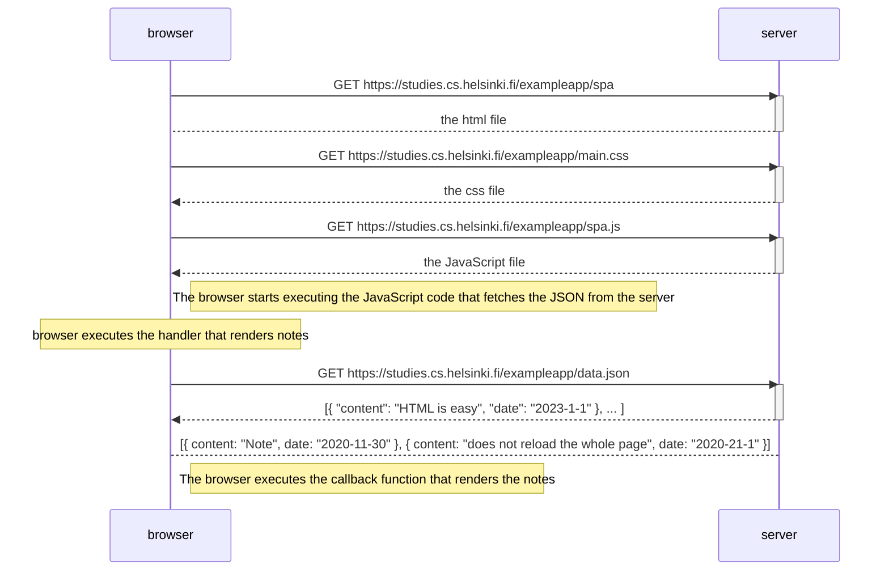

```mermaid
sequenceDiagram
    participant browser
    participant server

    browser->>server : GET https://studies.cs.helsinki.fi/exampleapp/spa
    activate server
    server-->browser : the html file
    deactivate server

    browser->>server: GET https://studies.cs.helsinki.fi/exampleapp/main.css
    activate server
    server-->>browser: the css file
    deactivate server

    browser->>server: GET https://studies.cs.helsinki.fi/exampleapp/spa.js
    activate server
    server-->>browser: the JavaScript file
    deactivate server

    Note right of browser: The browser starts executing the JavaScript code that fetches the JSON from the server
    note over browser: browser executes the  handler that renders notes

    browser->>server: GET https://studies.cs.helsinki.fi/exampleapp/data.json
    activate server
    server-->>browser: [{ "content": "HTML is easy", "date": "2023-1-1" }, ... ]
    deactivate server

    server-->browser: [{ content: "Note", date: "2020-11-30" }, { content: "does not reload the whole page", date: "2020-21-1" }]

    Note right of browser: The browser executes the callback function that renders the notes

```
